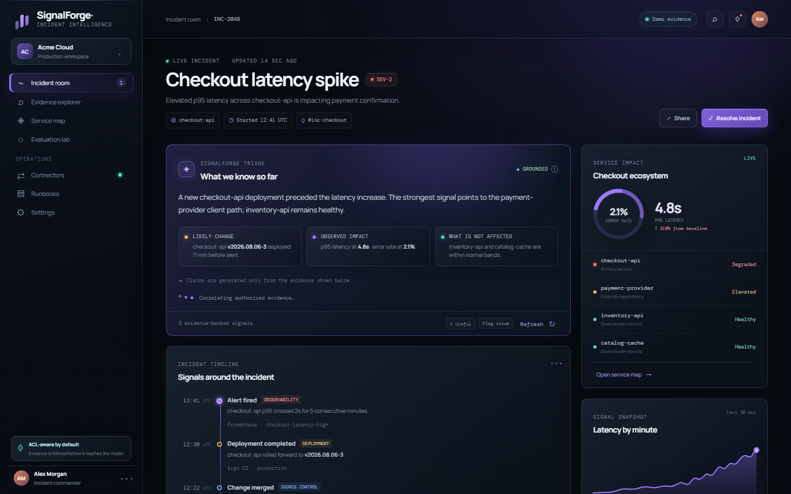
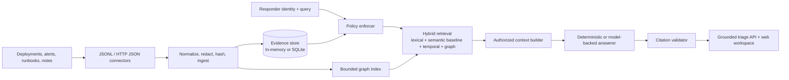
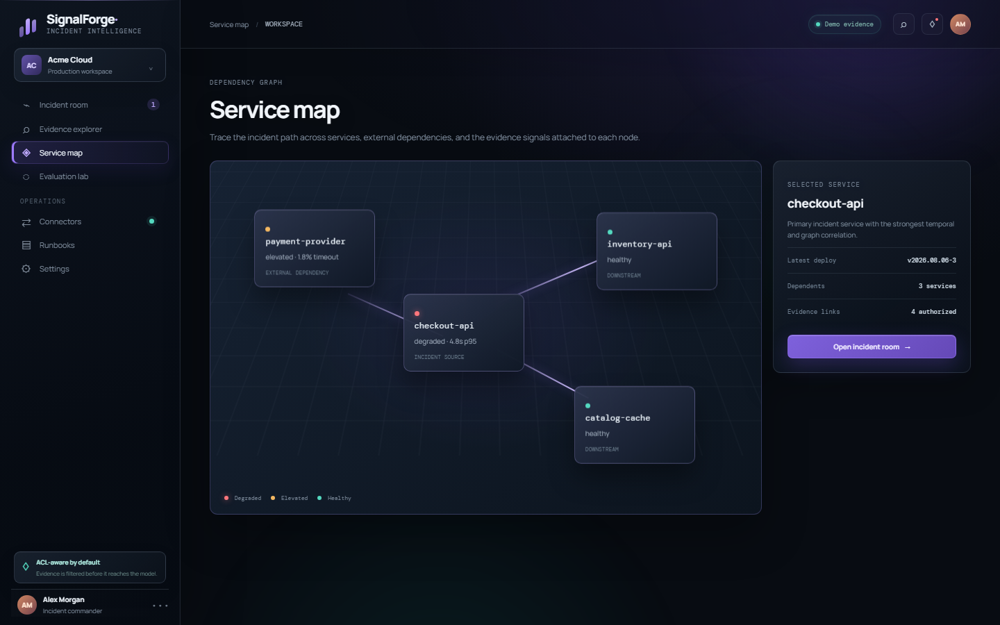

# SignalForge — Incident Intelligence Platform

> **Evidence-first incident triage for teams that need fast answers they can verify.**

[](https://www.python.org/)
[](https://fastapi.tiangolo.com/)
[](https://www.docker.com/)
[](.github/workflows/ci.yml)
[](#license)

[](https://render.com/deploy?repo=https://github.com/shubham94119/signalforge)

<p align="center">
  
</p>

## The problem

During an incident, responders must correlate deployments, alerts, runbooks, operational notes, and service relationships—often while permissions differ across teams. Manual investigation is slow, context switching is expensive, and an unverified AI answer can make an outage worse.

SignalForge is a runnable reference implementation of an **ACL-aware incident-intelligence workspace**. It ingests operational evidence, filters it by identity before retrieval, ranks it with hybrid and graph-aware signals, and produces grounded triage responses whose claims are checked against cited evidence.

## What it does

| Capability | Why it matters |
| --- | --- |
| **Evidence-first triage** | Responders get a concise incident summary, structured claims, source cards, and explicit limitations. |
| **ACL-aware retrieval** | Tenant isolation, deny-by-default policy checks, and final authorization checks prevent unauthorized evidence from reaching the model. |
| **Hybrid + graph-aware ranking** | Lexical, semantic-baseline, temporal, quality, metadata, and graph-neighbor signals identify the most relevant evidence. |
| **Citation validation** | Claims are checked for citation existence, authorization, support, numeric consistency, and allowed claim types. |
| **Operator workspace** | A responsive dark UI includes an incident room, evidence explorer, service map, evaluation lab, connector status, runbooks, settings, and feedback. |
| **Local model option** | Use the deterministic evidence-first answerer by default or connect an OpenAI-compatible endpoint such as local Ollama. |

## Product flow

1. A connector or API submits canonical evidence with source metadata, ACL state, timestamps, and lineage.
2. The ingestion pipeline redacts credential-shaped content, hashes the payload, upserts evidence, and records lifecycle state.
3. A responder asks an incident question with a tenant, user, group context, time window, service, and environment filters.
4. SignalForge authorizes evidence **before** ranking, applies hybrid and graph-aware retrieval, and rebuilds an authorized context.
5. The answerer creates structured claims; citation validation rejects unsupported, unauthorized, or malformed claims.
6. The UI displays the grounded response, evidence cards, timeline, and feedback controls.

## Architecture



## Screenshots

| Incident room | Service map |
| --- | --- |
|  |  |

### Demo capture checklist

The two screenshots above are included in the repository. Add the following GitHub-safe assets for a richer portfolio demo:

| Add this file | Capture this view |
| --- | --- |
| `./public/screenshots/evidence-explorer.png` | Evidence search and source-type filtering |
| `./public/screenshots/evaluation-lab.png` | Quality metrics and smoke-gate results |
| `./public/screenshots/connectors.png` | Connector health and ingestion status |
| `./public/screenshots/runbooks.png` | Expandable operational runbook checklist |
| `./public/screenshots/settings.png` | Identity context and model connection settings |
| `./public/screenshots/account-switcher.png` | Incident-commander switching and sign-out flow |
| `./public/demo.gif` | Ask a triage question, inspect citations, and open the service map |

## Key features

### Secure evidence lifecycle

- Canonical evidence, ACL, identity, query, claim, citation, feedback, and answer models.
- Tenant isolation with deny-by-default authorization and explicit-deny precedence.
- Credential-shaped text redaction, content hashing, idempotent upsert behavior, tombstones, checkpoints, and an outbox projection log.
- In-memory storage for fast demos and a SQLite-backed store for local persistence.

### Retrieval and investigation

- Hybrid retrieval using lexical overlap, a lightweight semantic baseline, temporal relevance, evidence quality, and source/service/environment filters.
- Bounded graph relationships and graph-neighbor scoring to connect related services and operational entities.
- Incident timeline endpoint scoped to evidence the caller is allowed to see.
- Structured responses with `grounded`, `partial`, `evidence_only`, and insufficient-evidence behavior.

### Grounding and quality controls

- Authorized context assembly before generation and a final ACL check before response delivery.
- Claim-level citation validation for source existence, access rights, source support, numeric claims, and allowed claim types.
- Deterministic answerer for predictable local behavior.
- Optional OpenAI-compatible model gateway with strict structured JSON parsing and deterministic fallback.
- Evaluation datasets, release gates, and metrics for recall, MRR, grounding, citation coverage, abstention, forbidden-evidence rate, and latency.

### Responsive operator experience

- Incident room with triage, timeline, evidence filtering, impact snapshot, and feedback.
- Evidence Explorer, Service Map, Evaluation Lab, Connectors, Runbooks, and Settings workspace views.
- Local incident-commander switcher, availability controls, sign-out screen, and keyboard-friendly menus.
- Premium responsive UI with progressive 3D depth effects that honor reduced-motion preferences.

## Technology stack

| Area | Implementation |
| --- | --- |
| Language | Python 3.11+; vanilla HTML, CSS, and JavaScript for the web UI |
| API | FastAPI and Uvicorn (optional `api` dependency group) |
| Evidence persistence | In-memory store or SQLite (`SQLiteEvidenceStore`) |
| Retrieval | Custom lexical, semantic-baseline, temporal, metadata, quality, and graph-neighbor scoring |
| Graph | Bounded in-memory provenance-shaped graph index |
| AI integration | Provider-neutral gateway for OpenAI-compatible chat-completions APIs; Ollama supported locally |
| Connectors | JSONL fixture connector and retrying generic HTTP JSON connector |
| Evaluation | Versioned JSON datasets, evaluation runner, release gates, and smoke fixtures |
| UI | Static responsive web workspace served by Python HTTP server locally or Nginx in Docker Compose |
| Delivery | Dockerfile, Docker Compose, PowerShell startup scripts, and GitHub Actions CI |
| Testing | Python `unittest`, compile checks, model-gateway mocks, and evaluation smoke gate |

## Repository structure

```text
.
├── apps/
│   ├── api/                 # FastAPI adapter and HTTP endpoints
│   ├── web/                 # Responsive operator workspace
│   └── cli.py               # Local retrieval and evaluation demos
├── connectors/              # Connector contracts, JSONL, and HTTP JSON adapters
├── docs/                    # BRD, implementation plan, completion matrix
├── evals/datasets/          # Versioned evaluation fixtures
├── public/screenshots/      # README screenshots
├── render.yaml              # Render demo deployment Blueprint
├── scripts/                 # Windows startup and test helpers
├── src/incident_intelligence/
│   ├── ingestion.py         # Evidence ingestion, redaction, tombstones
│   ├── policy.py            # ACL authorization policy
│   ├── retrieval.py         # Hybrid retrieval and ranking
│   ├── graph.py             # Bounded graph index
│   ├── answering.py         # Grounded triage orchestration
│   ├── citations.py         # Citation validation
│   ├── model_gateway.py     # OpenAI-compatible model gateway
│   ├── persistence.py       # SQLite evidence store
│   └── evaluation.py        # Evaluation and release gates
└── tests/                   # Security, retrieval, connector, model, and quality tests
```

## Quick start

### Prerequisites

- Python **3.11+**
- PowerShell (commands below target Windows)
- Optional: Docker Desktop for the containerized path
- Optional: [Ollama](https://ollama.com/) for a local language model

### Run locally

```powershell
git clone <your-repository-url>
cd Advance-RAG

python -m venv .venv
.\.venv\Scripts\Activate.ps1
python -m pip install --upgrade pip
pip install -e ".[api]"

# Starts the seeded API on :8000 and the UI on :5173.
.\scripts\start_local.ps1
```

Open:

- Web workspace: <http://127.0.0.1:5173>
- Interactive API docs: <http://127.0.0.1:8000/docs>
- Readiness probe: <http://127.0.0.1:8000/readyz>

The local script enables `DEMO_SEED=1` by default. The seed is intentionally for development only and is blocked in production mode.

### Run with a local Ollama model

```powershell
ollama pull llama3.2:3b
.\scripts\start_api_ollama.ps1
```

The helper configures the OpenAI-compatible Ollama endpoint and uses a 180-second first-load timeout. No hosted-model API key is required for this local path.

### Run with Docker Compose

```powershell
Copy-Item .env.example .env
docker compose up --build
```

Docker exposes the API on port `8000` and serves the UI through Nginx on port `5173`. The Compose file mounts `./data` for the SQLite evidence database.

### Deploy the hosted demo to Render

The repository includes a [`render.yaml`](render.yaml) Blueprint for the selected demo topology:

- `signalforge-api`: Docker-based Render Web Service on `/readyz`
- `signalforge-web`: Render Static Site served from `apps/web`
- deterministic answerer: enabled by leaving `MODEL_ENDPOINT` unset
- SQLite demo database: stored in the service filesystem for a lightweight demo

You can use the **Deploy to Render** button above or create a new Blueprint from this repository in Render. The static-site build writes `SIGNALFORGE_API_BASE` into `apps/web/config.js` so browser requests reach the API service. If you use a custom API domain, update that environment variable in the `signalforge-web` service.

> The Render Blueprint is intentionally a staging/demo deployment. Render free instances and local SQLite are not durable production storage. A production rollout still requires the managed PostgreSQL adapter, OIDC authentication, persistent data/retention controls, and the approvals listed in the [completion matrix](docs/COMPLETION_MATRIX.md).

Render Blueprint reference: [render.yaml](render.yaml).

## Configuration

Copy `.env.example` to `.env` when using Docker Compose or when you want an explicit local configuration.

| Variable | Purpose | Local default |
| --- | --- | --- |
| `APP_ENV` | Runtime environment. Production mode enables startup safeguards. | `development` |
| `AUTH_MODE` | Authentication mode marker. Production startup requires `oidc`. | `local` |
| `INCIDENT_DB_PATH` | SQLite path for persistent evidence and feedback. | `./data/evidence.db` |
| `DEMO_SEED` | Loads three local sample records; never enable in production. | `1` |
| `MODEL_ENDPOINT` | Optional OpenAI-compatible chat-completions endpoint. | Unset by API; `.env.example` targets local Ollama |
| `MODEL_API_KEY` | Optional model-provider key; `ollama` for local Ollama. | Provider-specific / `ollama` in example |
| `MODEL_NAME` | Model name sent to a configured gateway. | `llama3.2:3b` |
| `MODEL_TIMEOUT_SECONDS` | Model request timeout. | `15` in API; `180` in Ollama helper/example |
| `UI_ORIGIN` | Browser origin permitted by API CORS. | `http://127.0.0.1:5173` |

> `AUTH_MODE=oidc` is a production startup guard in this reference implementation. OIDC/JWKS token validation and identity-provider integration still require organization-specific implementation.

## API usage

The API models the trusted identity context through request headers. In a production deployment, these values should be derived from a validated identity layer—not accepted directly from an untrusted browser.

### Search authorized evidence

```powershell
Invoke-RestMethod `
  -Uri 'http://127.0.0.1:8000/v1/evidence?q=checkout%20latency' `
  -Headers @{
    'X-Tenant-ID' = 'demo'
    'X-User-ID' = 'alice'
    'X-Groups' = 'oncall'
  }
```

### Run grounded triage

```powershell
$headers = @{
  'Content-Type' = 'application/json'
  'X-Tenant-ID' = 'demo'
  'X-User-ID' = 'alice'
  'X-Groups' = 'oncall'
}

$body = @{
  text = 'What changed immediately before the checkout latency spike?'
  service_ids = @('checkout-api')
  environment = 'prod'
  limit = 8
} | ConvertTo-Json

Invoke-RestMethod -Method Post -Uri 'http://127.0.0.1:8000/v1/triage' -Headers $headers -Body $body
```

### Main endpoints

| Method | Endpoint | Description |
| --- | --- | --- |
| `GET` | `/healthz` | Liveness check |
| `GET` | `/readyz` | Readiness, evidence count, and model configuration status |
| `POST` | `/v1/evidence` | Ingest a canonical evidence record |
| `GET` | `/v1/evidence?q=...` | Search authorized evidence |
| `POST` | `/v1/triage` | Run grounded triage |
| `GET` | `/v1/incidents/{incident_id}/timeline` | Return authorized incident timeline events |
| `POST` | `/v1/feedback` | Record feedback on an answer or claim |
| `GET` | `/v1/admin/connectors` | View connector-derived source status |

## Validation and tests

```powershell
$env:PYTHONPATH = "$PWD\src"

# Unit and integration-style foundation tests
python -m unittest discover -s tests -p "test_*.py" -v

# Compile all application code
python -m compileall -q src apps connectors tests

# Run the retrieval + quality smoke gate
python -m apps.cli demo-eval
```

The included test suite covers authorization behavior, tenant isolation, redaction, tombstones, hybrid/graph/temporal retrieval, citation validation, SQLite durability, connectors, grounded abstention, evaluation gates, and model-gateway validation.

## Security and privacy posture

- **Deny by default:** records without a matching tenant and allowed principal are not retrievable.
- **Explicit deny wins:** denied principals override an allow rule.
- **Authorization before ranking:** results are ACL-filtered before retrieval ordering and rechecked before context assembly.
- **Evidence-bound answers:** material claims require validated citations; weak evidence triggers limited or abstaining responses.
- **Data minimization:** the ingestion layer redacts credential-shaped content before persistence.
- **Secure defaults:** API responses include `nosniff`, frame-deny, no-referrer, permissions-policy, and request-ID headers.

## Current scope and limitations

SignalForge is complete as a runnable, testable **local reference implementation**. It should not be represented as enterprise-production-ready without the external handoffs below:

- Vendor-specific deployment, incident, observability, documentation, and service-catalog adapters with approved read-only credentials.
- Production identity integration (OIDC issuer, JWKS validation, audience, group mapping, and session handling).
- Production-grade database, object storage, lexical/vector index, graph store, residency, retention, and deletion policies.
- Model-provider approval, cost/quality review, production prompt evaluation, and load/soak/DR testing.
- Real pilot incidents, responder UAT, expert labels, accessibility review, and security testing.

See the [completion matrix](docs/COMPLETION_MATRIX.md) for the phase-by-phase implementation boundary and [implementation plan](docs/IMPLEMENTATION_PLAN.md) for the delivery sequence.

## Roadmap

### Implemented locally

- [x] Canonical evidence and ACL models
- [x] Ingestion, redaction, SQLite persistence, tombstones, checkpoints, and outbox
- [x] JSONL and retrying HTTP JSON connector foundations
- [x] Hybrid, temporal, metadata, and graph-aware retrieval
- [x] Grounded triage, citation validation, deterministic fallback, and optional model gateway
- [x] Evaluation harness, smoke dataset, CI, Docker, local scripts, and responsive workspace

### Next production milestones

- [ ] Source-system-specific connectors and identity-provider integration
- [ ] Durable production vector/graph infrastructure and governance controls
- [ ] Pilot data collection, expert relevance labels, and quality/cost baselines
- [ ] Accessibility, security, performance, disaster-recovery, and responder acceptance testing

## Documentation

- [Business Requirements Document](docs/BRD.md)
- [Implementation Plan](docs/IMPLEMENTATION_PLAN.md)
- [Completion Matrix](docs/COMPLETION_MATRIX.md)

## Contributing

Contributions should preserve the core security contract: carry tenant and ACL metadata through every projection, authorize before ranking, re-authorize before context construction, retain stable citations, and run the test suite plus smoke evaluation before submitting a change.

## License

No license file is currently included. Add a `LICENSE` file before publishing or accepting external contributions.

## Contact

For a portfolio version, replace this section with the maintainer's GitHub profile, LinkedIn, and contact email.
