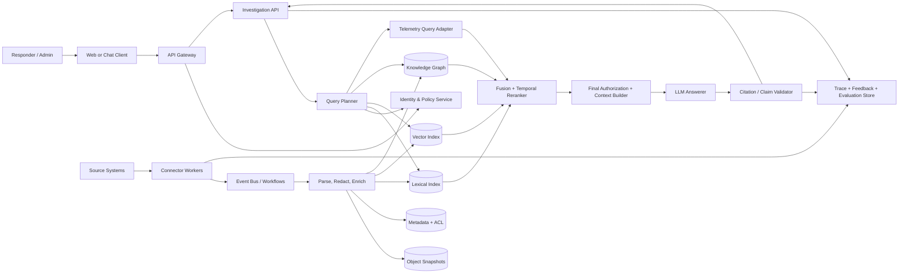

# SignalForge Incident Intelligence Platform: Implementation Plan

This plan implements the requirements in [BRD.md](BRD.md). It assumes a greenfield repository, an approximately seven-person delivery team, and an 18-week MVP pilot. Phase 0 turns the stated assumptions into approved decisions; estimates should be reforecast afterward.

## 1. Delivery approach

### 1.1 Guiding principles

- Authorization is a retrieval invariant, not a user-interface feature.
- Build an evidence product first; generation is a replaceable layer over it.
- Treat event time, source time, and ingestion time as different fields.
- Preserve provenance and version every derived artifact.
- Use deterministic filters and validators around probabilistic models.
- Evaluate per incident and persona before optimizing averages.
- Prefer small, bounded graph traversals over unrestricted agentic exploration.
- Degrade to authorized evidence search when generation or a model provider is unavailable.

### 1.2 Recommended default stack

Final choices require architecture decision records (ADRs) in Phase 0.

| Layer | Default | Reason |
|---|---|---|
| Web | TypeScript, React/Next.js | Mature component and streaming ecosystem |
| API/orchestration | Python 3.12, FastAPI, Pydantic | Strong retrieval/ML libraries and typed APIs |
| Workflow/events | Kafka-compatible bus plus durable worker framework | Replayable ingestion and long-running jobs |
| Metadata/audit | PostgreSQL | Transactions, policies, schemas, and operational familiarity |
| Lexical search | OpenSearch | BM25, metadata filters, highlighting, scale |
| Vector search | pgvector for pilot; dedicated vector store only if tests require it | Limits early operational sprawl |
| Knowledge graph | Neo4j or managed equivalent | Typed traversal and graph inspection |
| Raw snapshots | Versioned object storage | Reprocessing, audit, and cheap retention |
| Cache | Redis-compatible store | Short-lived identity/query caches with tenant-safe keys |
| Models | Provider adapters for embedding, reranking, and generation | Portability and controlled evaluation |
| Telemetry | OpenTelemetry plus the organization's metrics/log/trace backend | End-to-end diagnostics |
| Infrastructure | Containers, Kubernetes where already standard, Terraform, GitHub Actions or equivalent | Repeatable environments and delivery |

For a low-volume pilot, PostgreSQL can hold metadata and vectors. Do not adopt a separate vector database until benchmarked volume, filtering, or latency justifies it.

## 2. Target architecture



### 2.1 Trust boundaries

1. Client to gateway: authenticate, rate-limit, validate tenant context, and issue a correlation ID.
2. Gateway to internal services: workload identity and mutually authenticated private traffic.
3. Connectors to sources: independent read-only credentials with minimum scopes.
4. Retrieval stores: tenant partition/filter plus ACL envelope; no unscoped query interface.
5. Model boundary: only final-authorized, minimized context; contractual zero-retention/private endpoint where required.
6. Observability boundary: redact content and principal details; traces carry IDs and versions, not unrestricted evidence.

## 3. Canonical data design

### 3.1 Common evidence envelope

Every source object and derived chunk must carry:

```text
tenant_id
evidence_id / parent_evidence_id
source_type / source_instance / source_object_id / source_version
canonical_url / immutable_snapshot_uri / content_hash
title / content / content_type / language
service_ids / environment / region / entity_ids
event_time_start / event_time_end / source_updated_at / ingested_at
owner / classification / retention_policy
acl: allowed_principals, denied_principals, public_within_tenant,
     inherited_from, source_policy_version, resolved_at, expires_at
parser_version / chunker_version / embedding_version
quality_score / superseded_by / deleted_at
```

ACL sets must not be combined during deduplication. Content-identical records with different permissions remain separate authorization units or use a permission-safe posting structure proven by tests.

### 3.2 Principal model

- `tenant:<id>` establishes the hard isolation boundary.
- `user:<stable-id>` and `group:<stable-id>` represent identity-provider principals.
- `role:<id>` represents platform roles, not a substitute for source permissions.
- `source-user:<instance>:<id>` maps the platform identity to source-specific identity.
- Deny takes precedence; unresolved or expired policy state denies access.

The request authorization context is short-lived, tenant-bound, and keyed by identity and group-version. Permission-change events invalidate both identity and result caches.

### 3.3 Graph schema

Primary nodes:

- `Service`, `Team`, `Repository`, `Commit`, `PullRequest`, `Build`, `Deployment`
- `Environment`, `Cluster`, `Resource`, `Endpoint`, `Database`, `Queue`
- `Alert`, `MetricEvent`, `LogPattern`, `TracePattern`, `Dashboard`
- `Incident`, `TimelineEvent`, `Runbook`, `Postmortem`, `Evidence`

Primary edges:

- `OWNS`, `DEPENDS_ON`, `CALLS`, `RUNS_ON`, `USES_DATASTORE`
- `CONTAINS_COMMIT`, `BUILT_FROM`, `DEPLOYED_TO`, `CHANGED`
- `TRIGGERED`, `AFFECTED`, `OBSERVED_DURING`, `HAS_TIMELINE_EVENT`
- `DOCUMENTS`, `HAS_RUNBOOK`, `SIMILAR_TO`, `REFERENCES`

Every node and edge includes tenant, valid-from/to, observed-at, provenance, confidence, ACL reference, and whether it is asserted or inferred. Never create a `CAUSED_BY` edge from time proximity alone.

### 3.4 Storage consistency

- PostgreSQL stores the evidence registry, connector checkpoints, ACL metadata, configurations, feedback, and audit records.
- Object storage holds immutable authorized source snapshots and reproducible processing outputs.
- Search/vector indexes and graph are rebuildable projections keyed to the evidence registry.
- An outbox pattern publishes changes. Consumers are idempotent and update a projection-version ledger.
- Tombstones are high-priority events and a reconciliation job checks for remnants in every projection.

## 4. Source strategy

### 4.1 Recommended pilot order

1. Service catalog/CMDB: authoritative service, owner, repository, and dependency identities.
2. Incident system: incident window, severity, impact, services, and final resolution.
3. Deployment/CI-CD: deploy, build, commit, environment, actor, and rollback events.
4. Operational knowledge: runbooks, postmortems, architecture docs, and known issues.
5. Observability: alerts and structured exemplars first; bounded live queries for logs/metrics/traces.

### 4.2 Connector contract

Each connector implements:

```text
discover() -> source objects and cursor
fetch(object_id, version) -> content + metadata
fetch_acl(object_id) -> authoritative permission envelope
normalize(source_object) -> canonical records
subscribe_or_poll(cursor) -> changes and tombstones
health() -> permissions, quota, cursor lag, last success
```

Connector acceptance tests cover pagination, rate limiting, retries, duplicate delivery, partial failure, clock skew, ACL inheritance/change, rename/move, tombstone, backfill resume, and schema drift.

### 4.3 Telemetry policy

Do not copy all raw telemetry into the RAG corpus. Store alert events, dashboard/runbook metadata, exemplars, trace/log pattern summaries, and bounded aggregate windows. Query the observability source on demand using user- and tenant-authorized adapters. Redact secrets and cap time range, result count, and bytes.

## 5. Retrieval and response design

### 5.1 Query pipeline

1. Authenticate and build the tenant/principal authorization context.
2. Parse the question and incident context into services, entities, environment, time window, intent, and source routes.
3. Expand only validated service aliases and bounded graph neighbors.
4. Run ACL-filtered lexical, vector, metadata/event, and graph retrieval in parallel.
5. Normalize scores and combine channels with weighted reciprocal-rank fusion.
6. Apply incident-relative temporal features and source-quality features.
7. Rerank a bounded candidate set with a pinned model or deterministic ranker.
8. Reauthorize each candidate against current policy; remove inaccessible or stale-policy evidence.
9. Deduplicate and diversify by source, evidence type, service, time, and claim coverage.
10. Assemble a token-budgeted context with stable citation IDs and explicit metadata.
11. Generate a structured answer, validate claim/citation pairs, repair once, then omit or abstain.
12. Return streamed answer sections, authorized evidence cards, limitations, and trace/version ID.

### 5.2 Initial ranking model

Use a transparent baseline before learning weights:

```text
base = RRF(BM25 rank, vector rank, graph rank, event rank)
temporal = exp(-abs(evidence_event_time - target_time) / tau_by_type)
window = boost if evidence overlaps the incident or precursor window
topology = bounded boost by typed path, direction, depth, and edge confidence
quality = source authority * freshness * entity confidence
penalty = duplication + superseded + stale + low-confidence penalties
final = w1*base + w2*temporal + w3*window + w4*topology + w5*quality - penalty
```

`target_time` depends on intent: incident start for “what changed before,” alert time for “why did this alert fire,” or the latest valid state for runbook questions. Tune weights only on the training set, report metrics by query class, and validate on incidents from a later held-out period.

### 5.3 Temporal rules

- Default active-incident window: configurable precursor period plus incident duration to “now.”
- Deployment proximity is service- and environment-specific; a production deploy should not boost a development incident.
- Knowledge documents use valid/superseded time. Current questions penalize superseded runbooks.
- Similar-incident search excludes the current incident and avoids resolution leakage in historical replay tests.
- Missing event time lowers confidence; ingestion time is never silently substituted as equivalent.

### 5.4 Context contract

The model receives only final-authorized evidence in a machine-readable structure:

```json
{
  "question": "...",
  "incident": {"id": "...", "window": "...", "services": []},
  "evidence": [{
    "citation_id": "E1",
    "type": "deployment",
    "event_time": "...",
    "service": "...",
    "content": "...",
    "source": "...",
    "retrieval_reason": "..."
  }],
  "rules": ["Do not use outside knowledge as incident fact", "Cite material claims"]
}
```

The response schema contains `assessment`, `timeline`, `changes`, `hypotheses`, `suggested_checks`, `conflicts`, `limitations`, and a list of claims with citation IDs and epistemic type (`observed`, `source_asserted`, `inferred`, `suggested`).

### 5.5 Citation validation

Validation is a pipeline, not a prompt instruction:

1. Schema: every citation ID exists and every material factual claim has a citation.
2. Authorization: evidence remains authorized under the request context.
3. Attribution: cited span matches the named service, environment, value, and time.
4. Entailment: evidence supports the claim; a small validator model may assist, with deterministic checks for IDs, numbers, and timestamps.
5. Causality: causal wording requires explicit source support; otherwise rewrite as correlation/hypothesis.
6. Freshness/conflict: surface superseded or contradictory evidence.
7. Repair: provide only failed claims and permitted evidence for one repair attempt.
8. Fail safe: remove unsupported claims or return an evidence-only/insufficient-evidence response.

## 6. APIs and interfaces

Initial versioned endpoints:

| Method and path | Purpose |
|---|---|
| `POST /v1/investigations` | Start an ad hoc or incident-linked investigation |
| `GET /v1/investigations/{id}` | Load authorized state and history |
| `POST /v1/investigations/{id}/queries` | Stream a grounded triage response |
| `POST /v1/search` | Evidence-only hybrid search |
| `GET /v1/evidence/{id}` | Fetch an authorized evidence snapshot and source link |
| `GET /v1/incidents/{id}/timeline` | Return an authorized merged timeline |
| `GET /v1/entities/{id}/neighborhood` | Return a bounded, authorized graph view |
| `POST /v1/feedback` | Record answer/citation feedback |
| `GET /v1/admin/connectors` | Connector health and freshness |
| `POST /v1/admin/connectors/{id}/reconcile` | Start a controlled reconciliation job |
| `POST /internal/v1/evaluations` | Run a versioned evaluation suite |

All endpoints require an explicit tenant derived from trusted authentication, idempotency keys on mutating calls, correlation IDs, rate limits, stable error codes, and OpenAPI contracts. Clients cannot select arbitrary tenant or ACL filters.

## 7. Repository layout

```text
apps/
  web/                     # responder and admin interface
  api/                     # public API and streaming
services/
  ingestion/               # workflow entry points and processing
  retrieval/               # query planning, fusion, reranking
  policy/                  # identity mapping and authorization
  graph/                   # entity resolution and graph projection
  evaluation/              # datasets, runners, reports, release gates
connectors/
  base/                    # connector contract and conformance tests
  <source>/                # one package per source
packages/
  schemas/                 # canonical models and event/API contracts
  model_gateway/           # embedding/reranker/LLM adapters
  telemetry/               # safe logging/tracing helpers
infra/
  terraform/               # environment modules
  kubernetes/              # deployment manifests if used
tests/
  contract/ integration/ security/ e2e/ performance/
evals/
  datasets/ configs/ baselines/ reports/
docs/
  adr/ threat-model/ runbooks/ product/
```

Use one monorepo for the MVP to keep contracts and version changes atomic. Deploy services independently only where scaling or trust boundaries justify it.

## 8. Work plan and milestones

### Phase 0 — Discovery and risk retirement (Week 1)

Deliverables:

- Approve BRD owners, pilot team, source order, incident classes, and baseline metrics.
- Inventory data classification, ACL semantics, API limits, deletion behavior, and source IDs.
- Decide hosting, tenancy, residency, model providers, stores, and telemetry strategy through ADRs.
- Complete an initial threat model, data-flow diagram, and privacy assessment.
- Sample 10–20 resolved incidents and test whether sources contain enough evidence.
- Define final MVP gates, annotation guide, and cost envelope.

Exit gate: source access and identity mapping are proven with test accounts; no unresolved architecture or policy decision makes the MVP infeasible.

### Phase 1 — Platform foundation (Weeks 2–3)

Deliverables:

- Create monorepo, environment strategy, coding standards, and ownership rules.
- Establish CI with lint, types, unit tests, secret/dependency/image scanning, and artifact signing.
- Provision development and test infrastructure through code.
- Implement OIDC, tenant context, workload identity, secret management, and audit envelope.
- Define canonical schemas, schema compatibility checks, event topics, outbox, and connector SDK.
- Add OpenTelemetry, correlation IDs, safe logging, dashboards, and SLO skeletons.

Exit gate: a thin authenticated request and synthetic connector record traverse the platform with tenant isolation, traceability, and repeatable deployment.

### Phase 2 — Ingestion and evidence registry (Weeks 4–6)

Deliverables:

- Implement service catalog, incident, deployment, and knowledge connectors in priority order.
- Add backfill/checkpoint, webhook/polling, retry, replay, dead letter, reconciliation, and tombstone flows.
- Implement source-aware parsing, chunking, redaction, deduplication, ACL envelope, and immutable snapshot storage.
- Add lexical and vector projections with idempotent consumers.
- Build source conformance tests and freshness/deletion dashboards.
- Start expert annotation of the historic incident dataset.

Exit gate: representative source records stay synchronized under create/update/ACL-change/delete tests; lineage reaches every index record.

### Phase 3 — Secure hybrid retrieval baseline (Weeks 7–8)

Deliverables:

- Build search API, query parsing, source routing, lexical/vector retrieval, metadata filters, RRF, and evidence cards.
- Implement identity/group resolution, retrieval-time ACL filters, final authorization, safe caches, and share-by-reference behavior.
- Test cross-tenant, cross-group, revoked-user, stale-policy, hidden-count, snippet, citation, error, cache, and export attacks.
- Establish evidence-only relevance, latency, and cost baselines.

Exit gate: zero unauthorized results across the security suite; baseline Recall@10 and latency are measured on a held-out persona-aware dataset.

### Phase 4 — Graph and temporal intelligence (Weeks 9–11)

Deliverables:

- Implement entity registry, alias resolution, graph projection, provenance/confidence, and curator corrections.
- Populate service/dependency/deployment/incident relationships.
- Add bounded ACL-aware traversal and graph-derived retrieval reasons.
- Add incident-relative temporal features, environment matching, superseded-content penalties, source trust, fusion, and reranking.
- Run channel ablations to prove graph and temporal features add measurable value.

Exit gate: graph traversal cannot cross authorization boundaries; hybrid+graph+temporal retrieval beats the Phase 3 baseline by the agreed nDCG/Recall margin on the held-out set.

### Phase 5 — Grounded generation and citation controls (Weeks 12–13)

Deliverables:

- Implement model gateway, pinned configurations, context builder, token budget, structured response schema, and streaming.
- Build claim extraction, citation existence/coverage, attribution, numeric/time checks, entailment, causality checks, repair, and abstention.
- Add evidence-only degraded mode, provider timeout/budget controls, and prompt-injection defenses.
- Evaluate answer correctness, faithfulness, citation precision/coverage, conflicts, and abstention.

Exit gate: generation meets the agreed groundedness and citation gates; prompt-injection and unavailable-model tests fail safely.

### Phase 6 — Responder and admin experience (Weeks 14–15)

Deliverables:

- Build incident selection, investigation, streaming answer, timeline, filters, graph, evidence detail, freshness, and feedback interfaces.
- Build connector/freshness/admin status and evaluation release views.
- Conduct accessibility, usability, and responder workflow testing.
- Integrate an incident-system deep link or embedded entry point.

Exit gate: pilot responders complete all BRD user journeys and cannot reveal inaccessible information through any UI state.

### Phase 7 — Evaluation, hardening, and readiness (Weeks 16–17)

Deliverables:

- Freeze an adjudicated, time-split test set covering easy, ambiguous, conflicting, insufficient, and ACL-sensitive cases.
- Run functional, schema, migration, security, load, soak, chaos, recovery, deletion, and cost tests.
- Complete security/privacy review, model risk review, runbooks, on-call training, backups, restore exercise, and rollback plan.
- Establish production dashboards, alerts, budgets, and release gates.

Exit gate: all UAT criteria pass; no unresolved critical/high finding; product, security, and SRE approve the pilot.

### Phase 8 — Pilot and measured rollout (Week 18 plus 4-week observation)

Deliverables:

- Shadow mode on historical/live incidents without operational dependency.
- Limited opt-in pilot with daily quality/security review and weekly stakeholder report.
- Compare triage outcomes with baseline while tracking adoption, abstention, and regressions.
- Tune only through versioned changes that pass offline gates; retain one-click rollback.
- Produce MVP outcome report and prioritized post-MVP roadmap.

Exit gate: business and safety targets are achieved for the observation window, or a documented remediation decision is approved.

## 9. Epic backlog and completion criteria

| Epic | Key outcomes | Done when |
|---|---|---|
| E1 Platform and contracts | Environments, CI/CD, schemas, event contracts | Reproducible deploy and compatibility tests pass |
| E2 Identity and ACL | SSO, principal mapping, policy adapter, safe cache | Full adversarial suite shows no leakage |
| E3 Source ingestion | Priority connectors and lifecycle handling | Backfill/update/delete/reconcile and freshness SLO pass |
| E4 Evidence processing | Parse, redact, chunk, snapshot, index | Lineage/version checks and reprocessing pass |
| E5 Knowledge graph | Entities, edges, resolution, traversal | Provenance and ACL-bounded graph tests pass |
| E6 Hybrid retrieval | Query plan, channels, fusion, reranker | Held-out retrieval gate passes |
| E7 Temporal ranking | Incident window and event-time features | Ablation proves target gain without major regressions |
| E8 Grounded answers | Structured answer, citations, abstention | Citation and groundedness gates pass |
| E9 Responder UX | Investigation, timeline, evidence, feedback | UAT and WCAG target pass |
| E10 Evaluation and MLOps | Datasets, runners, reports, promotion | Reproducible run blocks bad release |
| E11 Reliability and operations | SLOs, recovery, runbooks, cost | Readiness review and recovery exercise pass |

## 10. Testing strategy

| Test layer | Coverage |
|---|---|
| Unit | Parsers, ACL decisions, rank features, time math, citation mapping, redaction |
| Property/fuzz | ACL combinations, malformed source records, timestamps, Unicode, oversized content |
| Contract | Source APIs, connector SDK, events, OpenAPI, model adapters, schema compatibility |
| Integration | Database/index/graph consistency, identity mapping, tombstones, replay, cache invalidation |
| Golden retrieval | Per-channel and fused ranked lists for versioned incident/persona cases |
| Generation | Structured output, evidence use, conflicts, numerical/time fidelity, abstention |
| Security | Tenant/group leakage, prompt injection, SSRF, IDOR, poisoned content, cache and log leakage |
| End-to-end | Ingest through UI/source-link journey under multiple personas |
| Performance | Backfill throughput, query load, graph fan-out, p95/p99, soak, provider limits |
| Resilience | Source/model/index outage, retry storms, partial projection, restore, region loss as applicable |
| Deletion/privacy | Revocation and deletion across snapshots, metadata, indexes, graph, cache, trace, exports |

Security tests must include paired personas where the only difference is access to a sensitive record; compare response text, citations, counts, timing within practical limits, suggested entities, and graph shape.

## 11. Evaluation framework

### 11.1 Dataset

For each example store:

- incident and query IDs, as-of time, persona/groups, intent, services, and environment;
- relevant and graded evidence IDs plus relevant time ranges;
- expected facts, acceptable inferences, conflicts, and required abstention;
- forbidden evidence/facts for the persona;
- annotators, rationale, confidence, adjudication, and source/index versions.

Start with 50–100 questions across 20 incidents for iteration, then target at least 300 adjudicated questions across 75 or more incidents for a credible pilot gate. Split by entire incident and chronological period; never scatter questions from one incident across tuning and test sets.

### 11.2 Offline metrics

| Area | Metrics |
|---|---|
| Retrieval | Recall@5/10/20, Precision@k, MRR, nDCG@10, evidence-type coverage |
| Graph | Relevant-path recall, entity resolution accuracy, path precision, graph ablation gain |
| Temporal | Time-window precision, precursor recall, event-order accuracy, temporal ablation gain |
| Answer | Expert correctness/completeness, faithfulness, conflict handling, useful abstention |
| Citations | Claim coverage, citation precision, entailment, source/time/entity attribution accuracy |
| Safety | Unauthorized evidence/claim rate, prompt-injection success, secret/PII leakage |
| Operations | Search/answer latency, freshness/deletion lag, error rate, token and infrastructure cost |

Use automated judges only as one signal. Calibrate them against blinded human review and report disagreement. Hard-coded and deterministic checks decide ACL, citation existence, IDs, and exact numeric/time consistency where possible.

### 11.3 Release gates

A candidate cannot be promoted if:

- any confirmed tenant/ACL leakage occurs;
- citation or groundedness falls below the approved threshold;
- a high-severity prompt-injection case succeeds;
- a critical query class regresses beyond its allowed budget;
- p95 latency, freshness, deletion, error, or cost exceeds its gate;
- dataset, prompt, policy, model, index, or code versions are missing from the report.

### 11.4 Online evaluation

Use a staged rollout with shadow, internal, opt-in pilot, then broader pilot cohorts. Track time-to-useful-evidence, evidence opens, answer/citation ratings, query reformulation, abandonment, abstention, incident outcome, and operational cost. Never A/B test relaxed authorization or citation safety.

## 12. Security implementation checklist

- Threat-model assets, actors, source trust, model boundary, ingestion poisoning, and data exfiltration paths.
- Validate webhook signatures and source payload schemas; scan/redact content before processing.
- Use egress allowlists and a fetch proxy; never let model text create unrestricted URLs or queries.
- Separate control-plane admin roles from data-plane investigator roles.
- Use read-only, per-source credentials and rotate them; record all use.
- Bind caches to tenant, principal/group-policy version, query, index version, and model configuration.
- Enforce graph depth/fan-out, search limits, token budgets, and rate limits.
- Treat retrieved text as untrusted data; delimit it and prohibit instruction following from evidence.
- Encrypt data and backups; document key ownership and rotation.
- Run SAST, dependency, image, IaC, secret, and license scans in CI.
- Conduct external penetration testing before broad production rollout.

## 13. CI/CD and configuration promotion

Pull-request checks:

- formatting, lint, types, unit/property/contract tests;
- schema/API compatibility and migration dry run;
- security, secret, dependency, container, and IaC scanning;
- a fast retrieval/citation regression suite using synthetic data.

Main-branch pipeline:

- create signed, immutable artifacts and SBOM;
- deploy to integration; run connector, projection, ACL, and end-to-end suites;
- run offline evaluation and compare to the approved baseline;
- publish a report containing code, data, policy, model, prompt, embedding, reranker, and index versions;
- require approval for production and use canary rollout with automated rollback.

Configurations are typed, reviewed, versioned, environment-scoped, and promoted like code. Production prompts or rank weights are never edited directly.

## 14. Observability and SLOs

Key signals:

- request rate/error/latency by safe query class and stage;
- retrieval channel duration/candidate counts, authorization removals, reranker and validator outcomes;
- model latency, rate limits, tokens, cost, schema failures, repair, and abstention;
- connector cursor lag, oldest unprocessed event, failure/retry/dead-letter, ACL freshness, tombstone lag;
- projection mismatch, graph fan-out, index freshness, cache hit/invalidations;
- user feedback and evaluation drift.

Alerts should identify the affected tenant/source without including evidence text. Initial SLOs come from the BRD; define error budgets and escalation paths during readiness review.

## 15. Team and governance

Recommended core team:

| Role | Allocation |
|---|---|
| Product manager / incident-domain owner | 1 |
| Technical lead / architect | 1 |
| Backend/retrieval engineers | 2 |
| Data/connector engineer | 1 |
| Frontend engineer | 1 |
| SRE/platform engineer | 0.5–1 |
| Security/privacy partner | 0.25–0.5 |
| Pilot incident responders/annotators | 2–4 part-time |

Operating cadence:

- Weekly product/engineering risk and metric review.
- Biweekly pilot demonstration and annotation calibration.
- ADR review for stores, model provider, tenancy, identity, telemetry, and deletion.
- Security/privacy checkpoints at Phase 0, pre-pilot, and any boundary change.
- A named owner and fallback owner for each connector, service, dataset, and runbook.

With fewer than five dedicated builders, reduce connector count or extend the schedule; do not compress ACL, evaluation, or readiness work.

## 16. Cost and capacity plan

During Phase 0 estimate daily changed documents, incident count, evidence queries, peak concurrency, graph size, telemetry query volume, tokens, and retention. Measure cost per source object ingested and per investigation.

Cost controls:

- content hashing and incremental embedding;
- source-aware chunk limits and summary/exemplar telemetry;
- prefiltering and small reranking candidate sets;
- context/token budgets and model tier routing based on evaluation;
- response caching only when authorization and freshness keys are safe;
- retention tiers and rebuildable projections;
- tenant budgets, provider quotas, alerts, and emergency generation disable switch.

## 17. Rollout and change management

1. Replay historical incidents with outputs visible only to the build team.
2. Run shadow mode during live incidents without entering results into the official timeline.
3. Train a small opt-in pilot group on evidence, inference, citations, freshness, and feedback.
4. Hold daily safety/quality triage for the first week and weekly reviews thereafter.
5. Expand by team/source only after cohort metrics and ACL tests pass.
6. Document user support, incident reporting, erroneous-answer handling, and emergency shutdown.
7. Publish limitations and keep human ownership of incident decisions explicit.

## 18. Definition of done

A feature is done when:

- acceptance criteria and threat cases are documented;
- code, schemas, migrations, configuration, and rollback are reviewed;
- unit, contract, integration, security, and relevant evaluation tests pass;
- tenant/ACL behavior is tested for allow, deny, missing, changed, and deleted states;
- telemetry is content-safe and dashboards/alerts are updated;
- performance and cost are within the feature budget;
- documentation, runbook, and ownership are current;
- the feature is demonstrated using representative authorized and unauthorized personas.

The project MVP is done only when the BRD UAT conditions and Phase 8 pilot gate pass, not when feature coding ends.

## 19. Requirements traceability

| BRD area | Delivery epics/phases | Primary proof |
|---|---|---|
| BR-01 unified evidence | E3, E4, E6; Phases 2–3 | Connector E2E and retrieval evaluation |
| BR-02 ACL preservation | E2 and every epic; Phases 1–7 | Persona/adversarial security suite |
| BR-03 hybrid/graph/time ranking | E5–E7; Phase 4 | Held-out metrics and ablations |
| BR-04 grounded citations | E8; Phase 5 | Claim/citation evaluation and UAT |
| BR-05 service graph | E5; Phase 4 | Entity/path precision and traversal tests |
| BR-06 uncertainty/abstention | E8; Phase 5 | Insufficient/conflicting evidence suite |
| BR-07 measurable quality | E10; Phases 0 and 7–8 | Versioned reports and release gate |
| BR-08 lineage/freshness/deletion | E3, E4, E11; Phases 2 and 7 | Reconciliation and deletion tests |
| BR-09 feedback | E9, E10; Phase 6 | Feedback workflow and audit test |
| BR-10 administration | E9; Phase 6 | Admin UAT and role tests |
| BR-11 workflow integration | E9; Phases 6 and 8 | Pilot journey completion |
| BR-12 enterprise path | E1, E2, E11 | Capacity, isolation, recovery evidence |

## 20. First ten working days

1. Name product, technical, security, SRE, and source owners.
2. Select one pilot team and 10–20 representative resolved incidents.
3. Complete source/ACL/identity inventory and obtain read-only sandbox access.
4. Measure baseline triage time and define “useful evidence.”
5. Decide tenancy, hosting, region, model boundary, retention, and target cost.
6. Write ADRs for search/vector/graph stores and indexed-vs-live telemetry.
7. Complete the first threat model and data-flow review.
8. Create the monorepo skeleton, CI, environments, and canonical evidence/ACL schemas.
9. Build a synthetic connector and two-persona ACL fixture end to end.
10. Review Phase 0 findings, update estimates, approve MVP gates, and start Phase 1.

## 21. Key deliverables at handoff

- Approved BRD, architecture/data-flow diagrams, ADRs, and threat model.
- Source connector inventory, contracts, runbooks, and ownership.
- Canonical schemas, API specifications, and graph ontology.
- Deployed product, infrastructure code, dashboards, alerts, backups, and recovery evidence.
- Versioned evaluation datasets, annotation guide, baseline/candidate reports, and release-gate configuration.
- Security/privacy review, penetration-test disposition, data-retention/deletion evidence, and audit design.
- Pilot training, support process, outcome report, known limitations, and post-MVP roadmap.
